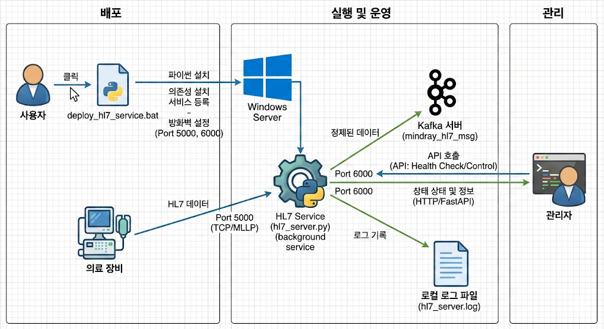
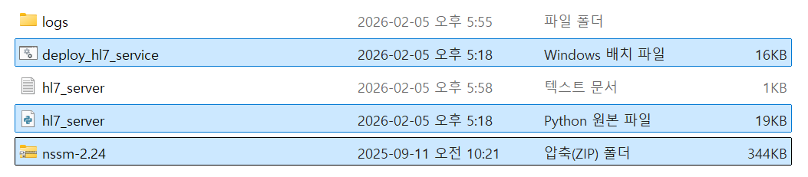
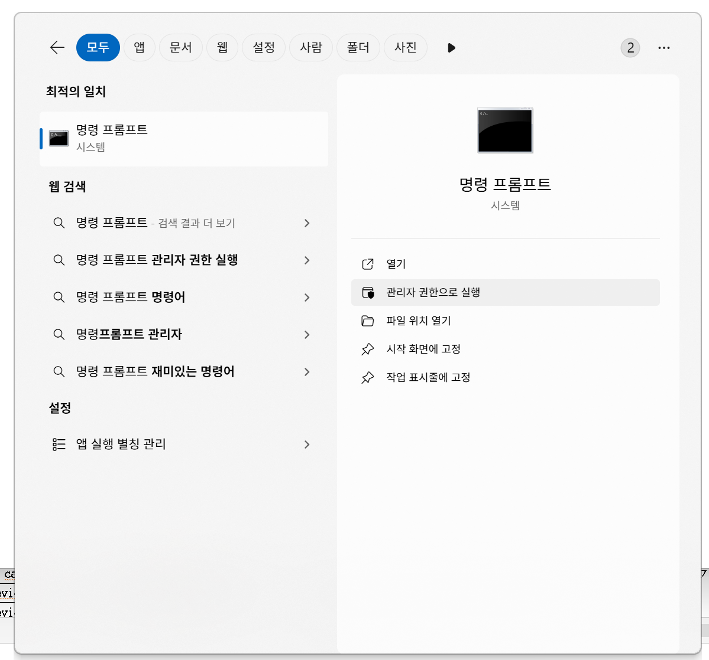

# safeS
> 동물 병원 의료 현장의 다양한 장비로부터 발생하는 HL7(Health Level Seven) 표준 메시지를 실시간으로 수집, 파싱하여 데이터 파이프라인(Kafka)으로 전송하는 통합 처리 시스템
>

---

## **deploy_hl7_service.bat**

> 사용자가 일일이 환경을 설정할 필요 없이, 
실행 한 번으로 모든 준비를 마칠 수 있게 설계된 **자동화 스크립트**
> 

### 기능(역할)

- **환경 자동 구성**
    
    : 시스템에 **파이썬**이 있는지 확인하고, 없으면 **파이썬 3.11.9 버전을 자동으로 다운로드**하여 설치
    
- **의존성 패키지 관리**
    
    : `fastapi`, `uvicorn`, `hl7apy`, `pandas`, `confluent-kafka` 등 서버 가동에 필요한 모든 **라이브러리를 자동으로 설치**
    
- **윈도우 서비스 등록 (NSSM 사용)**
    
    : 파이썬 스크립트(`hl7_server.py`)를 윈도우 서비스로 등록하여, **컴퓨터가 켜질 때마다 백그라운드에서 자동으로 실행**되도록 설정
    
- **네트워크 보안 설정**
    
    : HL7 메시지 수신을 위한 **5000번 포트(mindray), 3000번 포트(cardiac[울산 전용])**와 API 제어를 위한 **6000번 포트**(**Heartbeat**)를 윈도우 방화벽에서 자동으로 개방
    
- **자가 진단(Heartbeat)**
    
    : 설치 완료 후 서버가 정상적으로 응답하는지 **API 테스트**를 통해 확인
    
- **로깅 및 예외 처리**
    
    : 모든 수신 기록과 오류 상황을 `hl7_server.log` 및 `logs/` 폴더 내 파일에 기록하여 추후 유지보수 용이하게끔
    

---

## hl7_server.py

> 실제 의료 장비로부터 데이터를 받아 분석하고 다른 시스템으로 전달하는 **애플리케이션 본체**
> 

### 기능(역할)

- **멀티 프로토콜 통신**:
    - **TCP 서버 (Port 5000/3000)**: 의료 모니터 장비(Mindray 등)로부터 MLLP 프로토콜로 감싸진 HL7 메시지를 직접 수신
    - **FastAPI 서버 (Port 6000)**: 외부에서 서버의 상태를 확인하거나 데이터 전송을 시작/중단할 수 있는 HTTP 인터페이스를 제공
- **HL7 메시지 파싱**
    
    : 수신된 바이너리 데이터를 `hl7apy` 라이브러리를 사용하여 **분석 가능한 형태의 텍스트**로 변환
    
- **데이터 파이프라인 (Kafka)**
    
    : 처리된 HL7 메시지를 실시간으로 Kafka 브로커(`mindray_hl7_msg` 토픽 등)로 전송하여 상위 시스템에서 활용할 수 있게끔

---

| **구분** | **deploy_hl7_service.bat (배치 스크립트)** | **hl7_server.py (파이썬 스크립트)** |
| --- | --- | --- |
| **주 역할** | **자동 배포 및 서비스 관리(백그라운드 자동 실행)** | **HL7 통신 및 데이터 처리 엔진** |
| **주요 기능** | 환경 구축(Python 설치), 의존성 설치, 윈도우 서비스 등록, 방화벽 설정  | TCP 서버(HL7 수신), FastAPI(제어 API), Kafka 데이터 전송  |
| **작동 시점** | 최초 설치 시 또는 서버 재설정 시  | 서버 운영 중 실시간(백그라운드 실행)  |

---

## 사용 방법

- **사전 준비**:
    1. 파일들을 다음 경로에 배치합니다: `C:\Users\user\Project\safes_hl7_server`
        - 경로상에 공백이 포함되지 않도록 주의하십시오.
        - Project 폴더가 없으면 생성하시오.
          
    2. 필수 파일 목록: deploy_hl7_service.bat, hl7_server.py, nssm-2.24.zip

- **설치 및 실행**:
    1. 바로가기 생성: `deploy_hl7_service.bat` 파일의 바로가기를 바탕화면에 생성합니다.
    2. 권한 설정: 바로가기 우클릭 → [속성] → [고급] → **'관리자 권한으로 실행'**을 체크합니다.
    3. 배포 실행: 바로가기를 실행하면 시스템이 자동으로 Python 설치 확인, 패키지 설치, 방화벽 개방(Port 5000, 3000, 6000)을 진행합니다.
 
- **정상 작동 확인**:
    - 네트워크 상태 확인: 관리자 권한의 명령 프롬프트(CMD)에서 다음 명령어를 입력하여 6000번 포트가 LISTENING 상태인지 확인합니다.
        - `netstat -ano | findstr 6000`
        - 출력 예: `TCP    0.0.0.0:6000           0.0.0.0:0              LISTENING       pid`
          

          
          

    - `taskkill /f /pid pid` 명령으로 해당 프로그램을 종료할 수 있습니다.
    - 로그 확인: `C:\Users\user\Project\safes_hl7_server\logs\hl7_server.log` 경로에서 실시간 수신 및 오류 기록을 확인할 수 있습니다.
